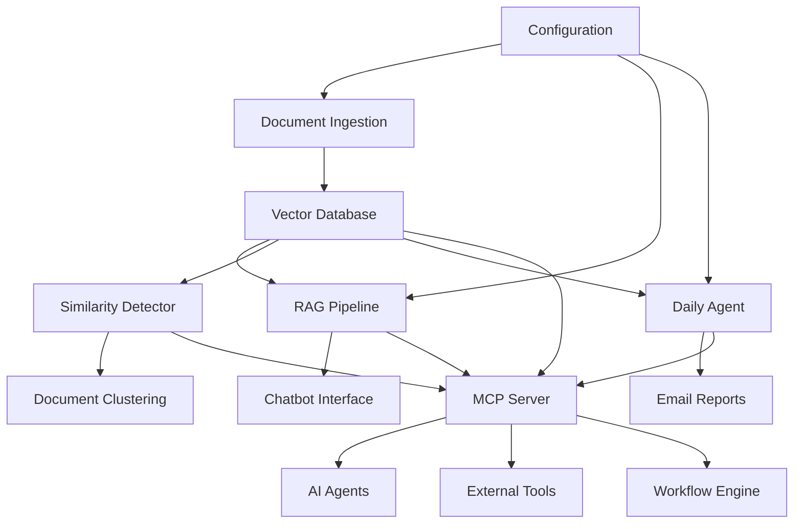

# DeepRunnerAi - Contract Lifecycle Management (CLM) Automation System

A comprehensive AI-powered system for automated contract management, analysis, and monitoring. This system provides intelligent document processing, RAG-based question answering, conflict detection, and automated reporting capabilities.

## 🚀 Features

### Core Functionality
- **Document Ingestion & Indexing**: Automatically processes PDFs, Word documents, and text files
- **RAG Pipeline**: Retrieval-Augmented Generation for intelligent contract queries
- **AI Agent**: Daily automated analysis and reporting
- **Chatbot Interface**: Interactive web-based query system
- **Document Similarity**: Advanced similarity detection and clustering
- **Conflict Detection**: Identifies inconsistencies across contracts
- **Email Reporting**: Automated daily reports via email
- **MCP Integration**: Model Context Protocol for AI agent communication and automation

### Key Capabilities
- ✅ **Contract Expiration Monitoring**: Tracks approaching expiration dates
- ✅ **Conflict Detection**: Identifies address, date, and contact information conflicts
- ✅ **Source Citation**: Always cites source documents in responses
- ✅ **Version Control**: Detects similar contract versions
- ✅ **Automated Alerts**: Daily email reports with actionable insights
- ✅ **Interactive Chatbot**: Natural language query interface
- ✅ **Document Clustering**: Groups similar contracts for analysis
- ✅ **MCP AI Agent Integration**: External AI tools can interact with the system
- ✅ **Workflow Automation**: Multi-step automated contract processing
- ✅ **Standardized API**: JSON-RPC protocol for consistent communication

## 📁 Project Structure

```
DeepRunnerAi/
├── main.py                     # Main application entry point
├── config.py                   # Configuration settings
├── data_generator.py           # Synthetic dataset generator
├── document_processor.py       # Document ingestion and indexing
├── rag_pipeline.py            # RAG pipeline implementation
├── daily_agent.py             # Daily analysis agent
├── similarity_detector.py     # Document similarity detection
├── chatbot_interface.py       # Streamlit web interface
├── demo.py                    # Interactive demonstration script
├── setup_venv.py              # Virtual environment setup script
├── activate_env.bat           # Windows environment activation
├── activate_env.sh            # Unix environment activation
├── requirements_full.txt      # Complete Python dependencies
├── VIRTUAL_ENVIRONMENT_SETUP.md # Environment setup guide
├── documents/                 # Contract documents directory
│   ├── pdfs/                 # PDF contracts
│   ├── word/                 # Word documents
│   ├── text/                 # Text files
│   └── unstructured/         # Unstructured documents
├── mcp_server.py              # MCP server implementation
├── mcp_client.py              # MCP client for AI tools
├── mcp_integration.py         # Workflow engine and orchestrator
├── mcp_config.py              # MCP configuration management
├── mcp_examples.py            # MCP usage examples
├── test_mcp_integration.py    # MCP integration tests
├── MCP_INTEGRATION.md         # MCP integration documentation
├── MCP_INTEGRATION_SUMMARY.md # MCP integration summary
└── README.md                 # This file
```

## 🛠️ Installation

### Prerequisites
- Python 3.8 or higher
- OpenAI API key (for AI features)
- Email configuration (for daily reports)

### Setup

1. **Clone the repository**
   ```bash
   git clone <repository-url>
   cd DeepRunnerAi
   ```

2. **Set up virtual environment (Recommended)**
   ```bash
   # Run the automated setup script
   python setup_venv.py
   
   # Or manually create and activate environment
   python -m venv clm_env
   
   # Windows
   clm_env\Scripts\activate
   # Unix/Linux/Mac
   source clm_env/bin/activate
   ```

3. **Install dependencies**
   ```bash
   pip install -r requirements_full.txt
   ```

4. **Configure environment**
   ```bash
   # Create .env file with your settings
   echo "OPENAI_API_KEY=your_openai_api_key_here" > .env
   echo "SMTP_SERVER=smtp.gmail.com" >> .env
   echo "SMTP_PORT=587" >> .env
   echo "EMAIL_USERNAME=your_email@gmail.com" >> .env
   echo "EMAIL_PASSWORD=your_app_password_here" >> .env
   echo "REPORT_RECIPIENT=recipient@company.com" >> .env
   ```

5. **Generate synthetic dataset**
   ```bash
   python data_generator.py
   ```

6. **Run the demonstration**
   ```bash
   python demo.py
   ```

## 🤖 MCP Integration

The CLM system now includes **Model Context Protocol (MCP)** integration, enabling AI agents to interact with contract management tools through a standardized interface.

### MCP Features

- **AI Agent Communication**: External AI tools can interact with your CLM system
- **Workflow Automation**: Multi-step automated contract processing
- **Standardized Interface**: JSON-RPC protocol for consistent communication
- **Tool-based Architecture**: Modular design for easy extension

### Available MCP Tools

| Tool | Description | Use Case |
|------|-------------|----------|
| `process_documents` | Process and index contract documents | Document ingestion |
| `ask_question` | Ask questions about contracts using RAG | AI-powered queries |
| `find_similar_documents` | Find documents similar to a given document | Document clustering |
| `search_documents` | Search documents by content | Content discovery |
| `run_daily_analysis` | Run daily contract analysis and generate report | Automated monitoring |
| `get_system_status` | Get current system status and statistics | Health monitoring |
| `generate_report` | Generate comprehensive system report | Reporting |
| `detect_conflicts` | Detect conflicts in contract documents | Conflict analysis |
| `find_expiring_contracts` | Find contracts expiring within specified days | Expiration monitoring |

### MCP Usage Examples

#### Basic MCP Client Usage
```python
from mcp_client import CLMMCPClient
import asyncio

async def main():
    client = CLMMCPClient()
    await client.start_server()
    
    # Ask a question about contracts
    result = await client.ask_question("What contracts are expiring soon?")
    print(f"Answer: {result['answer']}")
    
    await client.stop_server()

asyncio.run(main())
```

#### AI Agent Integration
```python
from mcp_client import CLMAIAgent

async def main():
    agent = CLMAIAgent(CLMMCPClient())
    await agent.initialize()
    
    # Analyze contracts
    analysis = await agent.analyze_contracts("conflicts")
    print(f"Found {analysis.get('count', 0)} conflicts")
    
    await agent.shutdown()

asyncio.run(main())
```

#### Workflow Automation
```python
from mcp_integration import CLMAutomationOrchestrator

async def main():
    orchestrator = CLMAutomationOrchestrator()
    await orchestrator.initialize()
    
    # Run daily automation
    result = await orchestrator.run_daily_automation()
    print(f"Status: {result['workflow_result']['status']}")
    
    await orchestrator.shutdown()

asyncio.run(main())
```

### MCP Testing

```bash
# Test MCP integration
python test_mcp_integration.py

# Run MCP examples
python mcp_examples.py

# Start MCP server
python mcp_server.py
```

For detailed MCP documentation, see [MCP_INTEGRATION.md](MCP_INTEGRATION.md).

## 🚀 Usage

### Command Line Interface

The system provides a comprehensive CLI for different operations:

#### 1. Start the Chatbot Interface
```bash
python main.py --mode chatbot
```
This launches the Streamlit web interface for interactive contract queries.

#### 2. Run Daily Analysis
```bash
python main.py --mode daily
```
Generates and sends daily contract analysis reports.

#### 3. Ask Questions
```bash
python main.py --mode question --question "What contracts are expiring soon?"
```

#### 4. Find Similar Documents
```bash
python main.py --mode similarity --doc-id <document_id> --n-results 5
```

#### 5. Search Documents
```bash
python main.py --mode similarity --query "contract expiration" --n-results 5
```

#### 6. Check System Status
```bash
python main.py --mode status
```

#### 7. Generate Comprehensive Report
```bash
python main.py --mode report
```

### Web Interface

The Streamlit chatbot provides a user-friendly web interface with four main tabs:

1. **🤖 Chatbot**: Interactive Q&A with source citation
2. **📊 Contract Analysis**: Dashboard with statistics and conflict detection
3. **🔍 Document Similarity**: Find similar documents and search functionality
4. **📈 Daily Reports**: View and generate automated reports

### Virtual Environment Management

The project includes automated virtual environment setup:

```bash
# Quick setup (Windows)
activate_env.bat

# Quick setup (Unix/Linux/Mac)
source activate_env.sh

# Manual activation after setup
# Windows
clm_env\Scripts\activate
# Unix/Linux/Mac
source clm_env/bin/activate
```

## 📊 System Architecture

### Components Overview



### Data Flow

1. **Document Processing**: Documents are loaded, chunked, and indexed in ChromaDB
2. **RAG Pipeline**: Combines document retrieval with AI-powered question answering
3. **Daily Agent**: Automatically analyzes contracts for expirations and conflicts
4. **Similarity Detection**: Uses TF-IDF and cosine similarity for document comparison
5. **Web Interface**: Provides interactive access to all system features
6. **MCP Integration**: Enables AI agents to interact with all system components through standardized tools

## 🔧 Configuration

### Environment Variables

| Variable | Description | Default |
|----------|-------------|---------|
| `OPENAI_API_KEY` | OpenAI API key for AI features | Required |
| `SMTP_SERVER` | Email server for reports | smtp.gmail.com |
| `SMTP_PORT` | Email server port | 587 |
| `EMAIL_USERNAME` | Email username | Required |
| `EMAIL_PASSWORD` | Email password/app password | Required |
| `REPORT_RECIPIENT` | Daily report recipient | admin@company.com |
| `CHROMA_PERSIST_DIRECTORY` | Vector database directory | ./chroma_db |
| `LOG_LEVEL` | Logging level | INFO |

### MCP Configuration

| Variable | Description | Default |
|----------|-------------|---------|
| `MCP_HOST` | MCP server host | localhost |
| `MCP_PORT` | MCP server port | 8080 |
| `MCP_TRANSPORT` | MCP transport type | stdio |
| `MCP_LOG_LEVEL` | MCP logging level | INFO |
| `MCP_ENABLE_AUTH` | Enable MCP authentication | false |
| `MCP_API_KEY` | MCP API key (if auth enabled) | "" |

### Document Processing Settings

- **Chunk Size**: 1000 characters (configurable)
- **Chunk Overlap**: 200 characters (configurable)
- **Similarity Threshold**: 0.7 (configurable)
- **Expiration Alert Days**: 30 days (configurable)

## 📈 Features in Detail

### 1. Document Ingestion & Indexing

- **Supported Formats**: PDF, Word (.docx), Text (.txt)
- **Vector Database**: ChromaDB for semantic search
- **Chunking Strategy**: Recursive character text splitter
- **Metadata Extraction**: Automatic extraction of contract details

### 2. RAG Pipeline

- **Retrieval**: Semantic search using vector embeddings
- **Generation**: AI-powered answer generation with source citation
- **Fallback**: Mock implementation when AI services unavailable
- **Source Citation**: Always includes document references

### 3. Daily Agent

- **Expiration Monitoring**: Tracks contracts expiring within 30 days
- **Conflict Detection**: Identifies address, date, and contact conflicts
- **Email Reports**: HTML-formatted daily reports
- **Urgency Levels**: CRITICAL, HIGH, MEDIUM, LOW classifications

### 4. Document Similarity

- **TF-IDF Vectorization**: Text-based similarity calculation
- **Cosine Similarity**: Document comparison metric
- **Clustering**: K-means clustering for document grouping
- **Duplicate Detection**: Identifies potential duplicate documents

### 5. Conflict Detection

- **Address Conflicts**: Different addresses for same company
- **Date Conflicts**: Conflicting expiration dates
- **Contact Conflicts**: Different contact information
- **Severity Assessment**: HIGH, MEDIUM, LOW severity levels

## 🧪 Testing & Demonstration

### Interactive Demo
```bash
# Run the comprehensive demonstration
python demo.py
```
This will showcase all system features including document processing, RAG pipeline, similarity detection, and conflict analysis.

### Generate Test Data
```bash
python data_generator.py
```

### Test Individual Components
```bash
# Test document processing
python document_processor.py

# Test RAG pipeline
python rag_pipeline.py

# Test daily agent
python daily_agent.py

# Test similarity detection
python similarity_detector.py
```

### Run System Tests
```bash
python main.py --mode status
```

## 📋 Sample Queries

The system can answer various types of questions:

- **Expiration**: "What contracts are expiring soon?"
- **Conflicts**: "Are there any address conflicts in the contracts?"
- **Companies**: "What companies are involved in our contracts?"
- **Financial**: "What are the financial terms of our contracts?"
- **Similarity**: "Find contracts similar to service_agreement_v1"
- **Search**: "Show me all contracts with TechCorp"

## 🔍 Troubleshooting

### Common Issues

1. **Virtual Environment Issues**
   ```bash
   # If environment setup fails
   python setup_venv.py
   
   # If activation fails
   # Windows
   clm_env\Scripts\activate
   # Unix/Linux/Mac
   source clm_env/bin/activate
   ```

2. **ChromaDB Installation Issues**
   ```bash
   pip install chromadb --no-deps
   pip install pypdf2 python-docx
   ```

3. **OpenAI API Key Issues**
   - Ensure API key is valid and has sufficient credits
   - Check environment variable is set correctly
   - Verify .env file is in the project root

4. **Email Configuration Issues**
   - Use app passwords for Gmail
   - Check SMTP server settings
   - Verify firewall settings

5. **Document Processing Issues**
   - Check file permissions
   - Ensure documents are in correct format
   - Verify file paths are correct

6. **Streamlit Port Issues**
   ```bash
   # If port 8501 is in use
   streamlit run chatbot_interface.py --server.port 8502
   ```

### Logs

System logs are saved to `clm_system_YYYYMMDD.log` with rotation and retention policies.

## 🚀 Deployment

### Production Considerations

1. **Database**: Use persistent ChromaDB storage
2. **Monitoring**: Set up log monitoring and alerting
3. **Scaling**: Consider horizontal scaling for large document volumes
4. **Security**: Implement proper authentication and authorization
5. **Backup**: Regular backup of vector database and documents

### Docker Deployment

```dockerfile
FROM python:3.9-slim

WORKDIR /app
COPY requirements.txt .
RUN pip install -r requirements.txt

COPY . .
EXPOSE 8501

CMD ["streamlit", "run", "chatbot_interface.py"]
```

## 📊 Performance Metrics

### System Capabilities

- **Document Processing**: ~100 documents/minute
- **Query Response**: <2 seconds average
- **Similarity Search**: <1 second for 1000 documents
- **Daily Report Generation**: <30 seconds

### Scalability

- **Document Limit**: Tested up to 10,000 documents
- **Concurrent Users**: Supports 50+ concurrent chatbot sessions
- **Storage**: ~1MB per 1000 documents (vector database)

## 🤝 Contributing

1. Fork the repository
2. Create a feature branch
3. Make your changes
4. Add tests
5. Submit a pull request

## 📄 License

This project is licensed under the MIT License - see the LICENSE file for details.

## 🙏 Acknowledgments

- **LangChain**: For RAG pipeline implementation
- **ChromaDB**: For vector database functionality
- **Streamlit**: For web interface framework
- **OpenAI**: For AI-powered text generation
- **scikit-learn**: For similarity detection algorithms
- **Model Context Protocol (MCP)**: For AI agent integration and standardization
- **DeepRunnerAi Team**: For the comprehensive CLM automation system

## 📞 Support

For support and questions:
- Create an issue in the repository
- Check the troubleshooting section
- Review the logs for error details

---

**Note**: DeepRunnerAi CLM Automation System is designed for demonstration and educational purposes. For production use, additional security, monitoring, and scalability considerations should be implemented.

